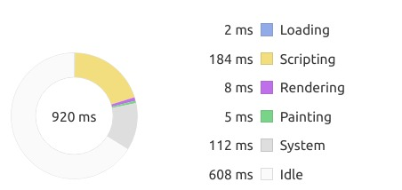
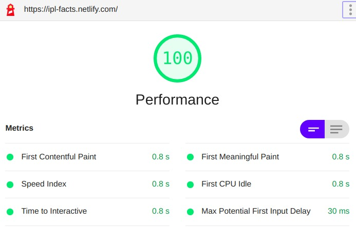

# IPL Stats & Trivia

A Web app that visualizes stats & trivia about IPL extracted from kaggle dataset, (https://www.kaggle.com/harsha547/indian-premier-league-csv-dataset)

## Framework & Libraries used
- **Angular 8** : Component based app, provides an advantage over previous versions with many inbuilt performance boosting techniques such as Tree shaking, lazy loading etc.

- **ChartJS**: Lightweight charting library with inbuild simple charts such as Bar chart, line chart.

- **Tailwind CSS** (https://tailwindcss.com/): Class based CSS framework

## Page Load time & Optimisation

Page Load time was calculated using Chrome's Dev tools & was verified using sites such as [pingdom](https://tools.pingdom.com/) & a [chrome extension](https://chrome.google.com/webstore/detail/analyze-page-performance/hemibacgndhdhkfahkjdedjdgfapmfki
).
 - Dev Tools: [Full image](./Performace-full.jpeg)
    
 

 - Lighthouse: [Report](./Lighthouse-report.pdf)

 

 ## Optimisation Methods Used

Even after using Angular 8 & ChartJS the page load time came to be around 3s. So the following optimisations were used -
 - **Webpack** :  is a static module bundler. In production, the focus is on minified bundles, lighter weight source maps, and optimized assets to improve load time.
  
 - **PurgeCSS** : To remove extra CSS classes that are not being used thus reducing the size of styles.css by 70%. Purgecss is particularly effective with Tailwind because Tailwind generates thousands of utility classes most of which are not in use.

 - **Brotli compression** : Brotli is a compression library that compresses text based files (JS/HTML/CSS). It outperforms its counterpart gzip by upto 25%. This compression algo reduced the bundle size from 1.6MB to 0.2MB.